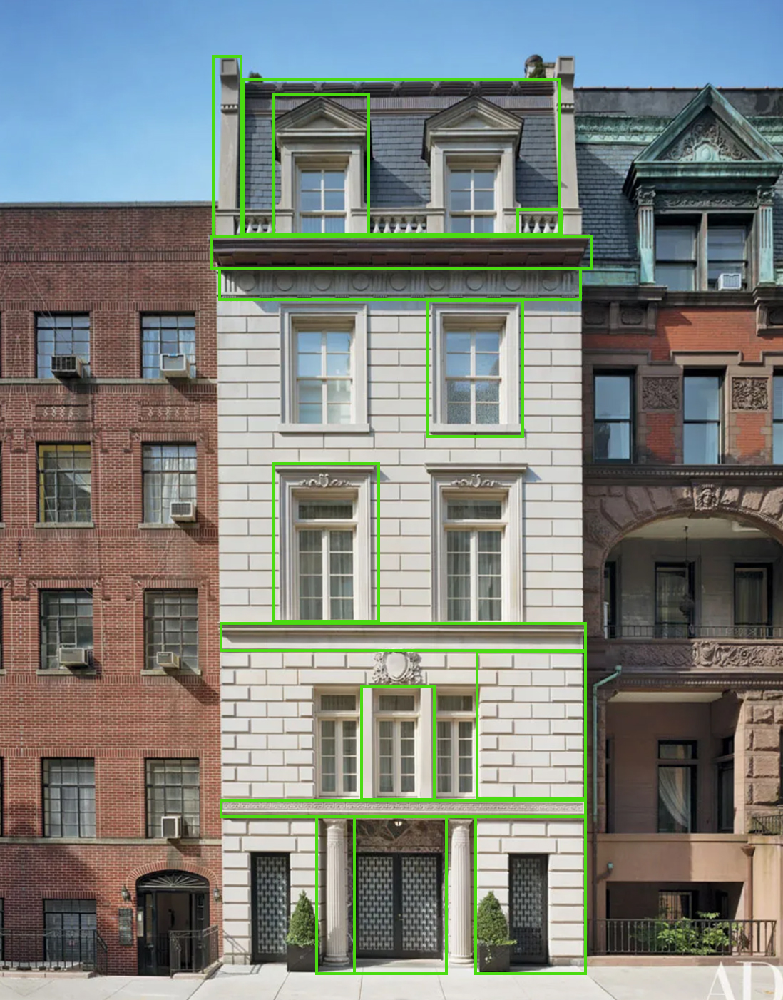
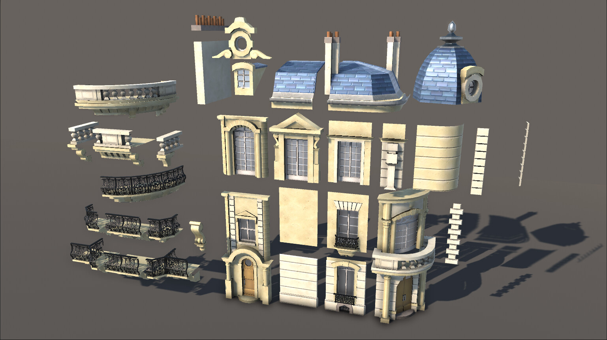

# Modulair Bouwen
Dit is een individuele opdracht waar je 2 weken de tijd voor hebt. Dit project heeft de volgende leerdoelen:
- Modulaire stukken bouwen in Maya of Blender
- 3D modelling, hard surface
- Unwrappen met UV Editor
- Texturen in Substance Painter
- Assets exporteren (FBX) voor Unreal en importen in Unreal
- Materials aanmaken in Unreal en assets klaarzetten
- In Unreal vanuit de losse onderdelen een gebouw in elkaar zetten

## Opdracht
Neem onderstaande referentie afbeelding en deel deze op in verschillende modulaire stukken in Maya / Blender door te kijken welke verschillende onderdelen er op dit gebouw zitten. De onderdelen zijn aangegeven met groene rechthoeken. 
De onderdelen modelleer je apart van elkaar en deze geef je direct een Unwrap. Sommige stukken komen vaker voor in het gebouw dus die hoef je maar 1 keer te modelleren. 

### Voorbeeld tutorial om modulair te bouwen
[Deze tutorial](https://www.youtube.com/watch?v=sRgzIX35OB8) kun je gebruiken om je op gang te helpen.

### Resultaat
Uiteindelijk heb je een modulaire building set gemaakt in Maya / Blender zoals je bijv. kan zien op onderstaande afbeelding:

Wanneer alle modulaire stukken gemodelleerd zijn kun je deze in Unreal importeren en materials aanmaken voor je modulaire stukken. Vervolgens snap je de stukken aan elkaar om het gebouw compleet te maken. 
