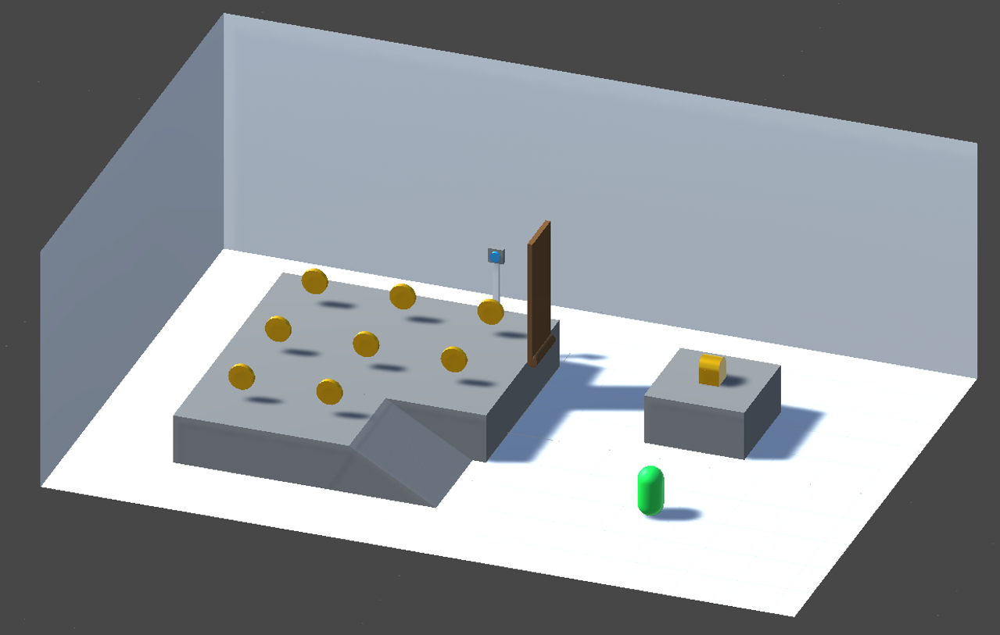

# Unreal Startup Project
Gedurende dit project gaan jullie in viertallen werken aan jullie eerste Unreal Engine project. Het project zal één week duren (maandag, dinsdag en vrijdag). Dit project heeft de volgende leerdoelen:

 - Leren samenwerken in een multidiciplinair team
 - De basis leren van de **Unreal Engine Editor**
 - Leren werken met Blueprints _(Developers)_
 - Leren assets importeren en in de scene zetten _(Artists)_
 - Leren werken met Perforce versie controle software

Aan het einde van deze week moet het prototype af zijn.

## Informatie
Jullie zullen begeleid worden door meer ervaren studenten. Dit zal jullie eerste aanspreekpunt zijn voor vragen over Unreal. Pas daarna kan je vragen stellen aan de docenten.

## De Opdracht
### Developers
De opdracht is om een simpel level te maken met een 3rd person character controller die kan springen en rond kan lopen. Het character mag niet op het platform van de chest kunnen springen.

Als alle muntjes zijn opgepakt zal de chest op het eiland verschijnen. De muntjes dienen een `Collider` te hebben waarme de collision gedetecteerd wordt.

Er is een knop op het grotere platform. Als de knop ingedrukt wordt zal de brug omvallen naar het eiland. Dit mag simpel met een rotatie of animatie.

Voor de interactie met de knop en de chest dient een `Interface` gebruikt te worden met een generieke `OnInteract` functie zodat de functionaliteit gescheiden is van de player. Beide dienen gevonden te worden door middel van een `Raycast`.

Zorg dat er een `Press [E] to Interact` op het scherm verschijnt alleen als de speler naar een interactable kijkt.

Als de kist geopend is (met een animatie of iets anders) dan is het spel af en de speler heeft dan gewonnen.

#### SCRUM
We werken met een SCRUM methodologie en termenologie. De Definition of Done DoD geld als volgt:
  _"Het werk is af als de feature getest is, correct werkt en in de scene en gepushed is op de development branch"_

#### Bonus
Maak een end-game UI scherm waarin de speler verteld wordt dat het level klaar is.

### Artists
Overleg eerst met de artists welke art-style er gekozen gaat worden voor dit mini-project. Hou in de gaten dat je drie dagen hebt om art assets te maken dus neem dit mee in je beslissing. Maak een style guide met elkaar.

Maak een asset lijst van alle assets die nodig zijn voor het prototype en verdeel daarna de taken voor elk van de onderdelen. Werk verticaal in plaats van horizontaal. Dus maak een asset helemaal af en zorg dat het voldoet aan de DoD en ga daarna pas verder met de volgende asset.

Het level en de level geometry is ook jullie taak.

#### SCRUM
We werken met een SCRUM methodologie en termenologie. De Definition of Done DoD geld als volgt:
  _"Het werk is af als de gemaakte asset in de scene op de juiste plaats staat in de development branch"_